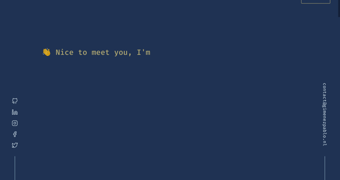

<!-- PROJECT LOGO -->
<br />
<p align="center">
  <h3 align="center">Portfolio</h3>
  <a href="https://gimenezpablo.nl">
    
  </a>
  <p align="center">
    Personal website
    <br />
    <br />
    <a href="https://github.com/gimenezpablonl/portfolio-v1/issues">Report Bug</a>
  </p>
</p>

<!-- ABOUT THE PROJECT -->

## 🤔 About the project
Personal website 😄
### 🦾 Built With

- [Typescript](https://www.typescriptlang.org/)
- [React](https://reactjs.org/)
- [Next.js](https://nextjs.org/)
- [Tailwindcss](https://tailwindcss.com/)
- [React-spring](https://react-spring.io/)

## ✨ Features
- 🎈 Progressive Web Application
- 🎯 Perfect Google Lighthouse score


## 🎨 Color Reference
### ⚪ Light scheme

| Usage | Color | Hex |
| - | - | - |
|Background| Link Water  |  `#deeff8`
|Subtitle |Calypso |  `#336194` |
|Text|Cloud Burst| `#1f3253` |
| Accent |Affair |  `#854490` |

### ⚫ Dark scheme

| Usage | Color | Hex |
| - | - | - |
|Background|Cloud Burst| `#1f3253` |
|Subtitle |Calypso |  `#336194` |
|Text| Link Water  |  `#deeff8`
| Accent |Straw |  `#d5c67a` |
<!-- GETTING STARTED -->

## 🚀 Getting Started

To get a local copy up and running follow these simple steps.

### 👀 Prerequisites

This is an example of how to list things you need to use the software and how to install them.

- git
- yarn

### 🔨 Installation

1. Clone the portfolio-v1
   ```sh
   git clone https://github.com/gimenezpablonl/portfolio-v1.git
   ```
2. Install NPM packages
   ```sh
   yarn
   ```

<!-- LICENSE -->

## 📕 License

Distributed under the ISC License. See `LICENSE` for more information.

<!-- CONTACT -->

## 📪 Contact

[@gimenezpablonl](https://twitter.com/gimenezpablonl) - contact@gimenezpablo.nl

<!-- CREDITS -->

## 🙌 Credits

- [brittanychiang](https://github.com/bchiang7) Design inspiration.